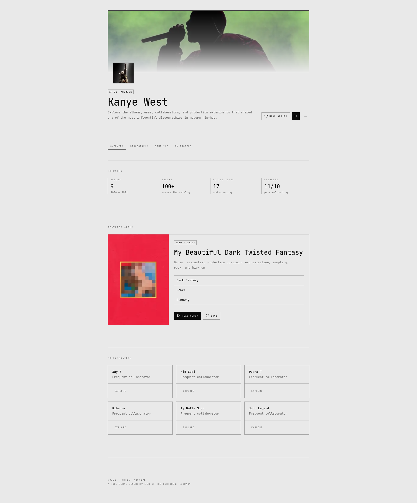

# nUIde

> Minimal UI components for modern web applications.

nUIde is a collection of simple, reusable UI components built with **React, TypeScript, Tailwind CSS, and Base UI**.



## Components

50+ components including:

- Accordion
- Alert
- Avatar
- Badge
- Button
- Card
- Dialog
- Dropdown Menu
- Input
- Pagination
- Select
- Sidebar
- Table
- Tabs
- Toast
- Tooltip
- And more.

## Development

```bash
bun install
bun dev
```

## License

MIT
